# python_dataviz

1. วิธีการ install Python

1.1 เริ่มจากดาวน์โหลด miniconda ใน internet โดยเลือกขนาดให้เท่ากับคอมพิวเตอร์ มีขนาด(32แล64bit)และเลือกดาวน์โหลดเวอร์ชั่น 3.7 แล้วกด install

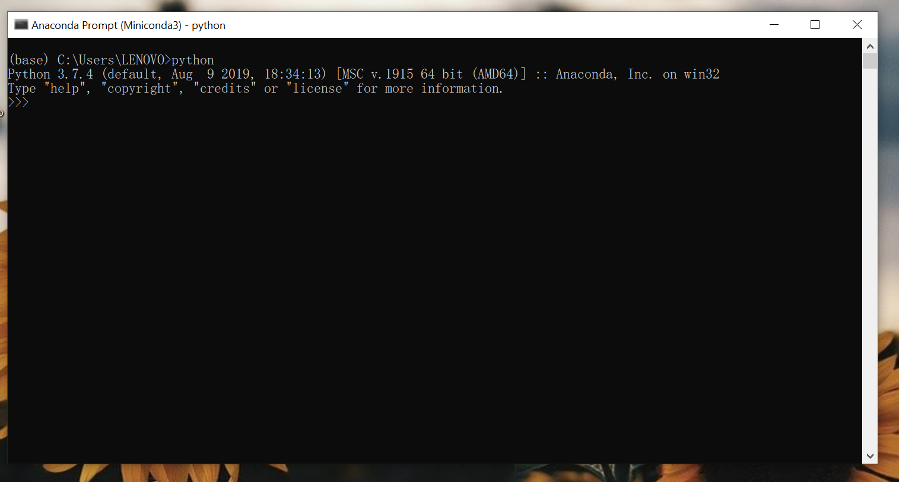
1.2 เลือกดูที่ Anaconda Prompt ในแถบ Menu Bar แล้วใช้คำสั่ง Python เพื่อเช็คดูว่าได้ install Python แล้ว 

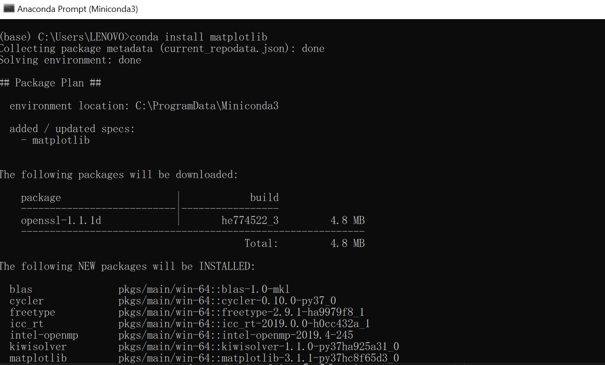
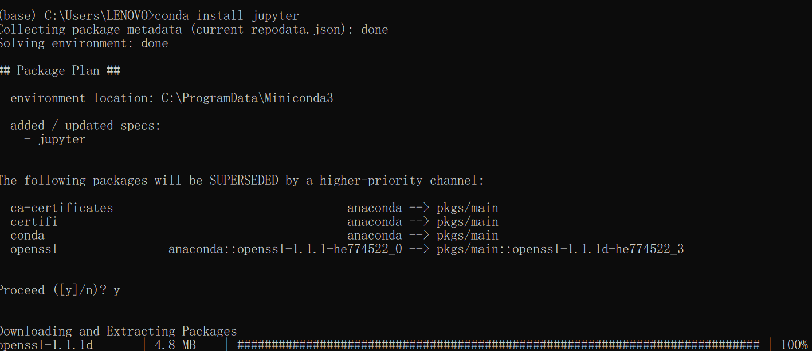
1.3 ทำการ import packet matplotlib และ jupyter โดยใช้คำสั่ง conda install ตามด้วยชื่อ packet

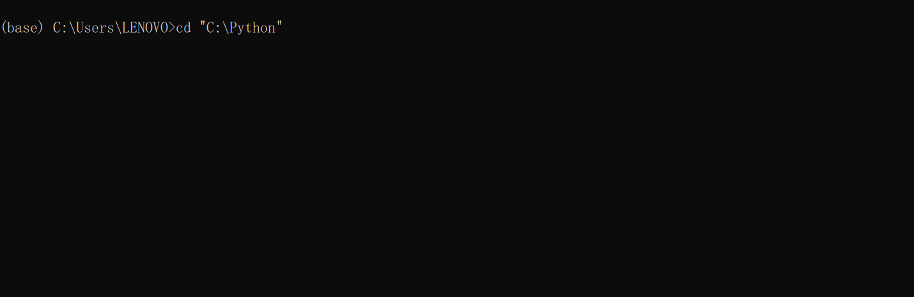
1.4 สร้าง Folder เพื่อนำมาไว้เก็บCode จากนั้นมาที่อยู่ของโฟลเดอร์นั้นมารันใน anaconda prompt โดยใช้คำสั่ง cd "ที่อยู่ของโฟลเดอร์"

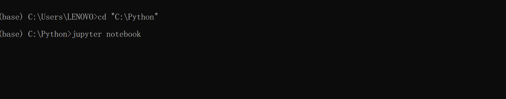
1.5 ใช้งาน Python โดยพิมพ์คำสั่ง jupyter notebook

2. การใช้งาน Colab

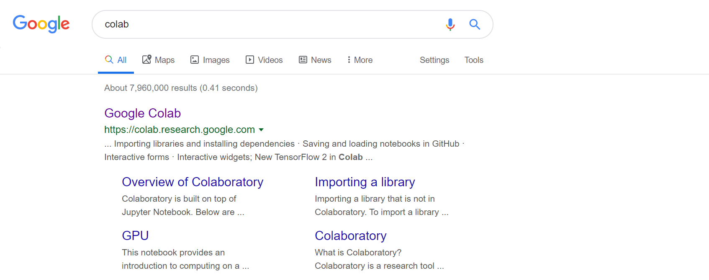
2.1 เริ่มจากการค้นหา โดยค้นหาว่า colab บน internet 

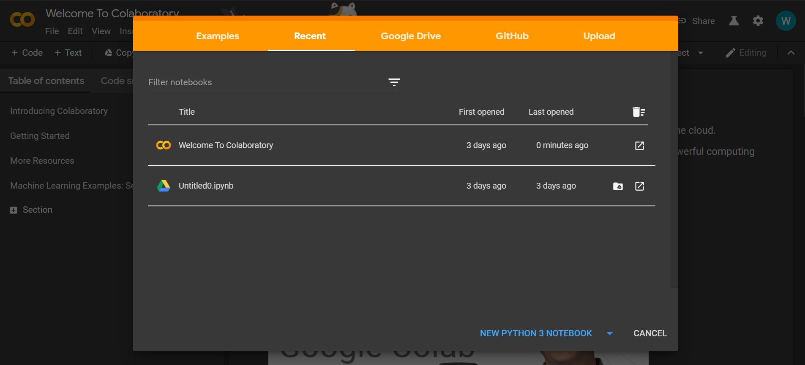
2.2 ทำการ sign in เข้าสู่ระบบโดยใช้ gmail

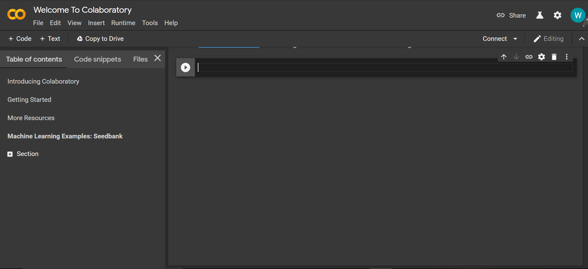
2.3 เมื่อต้องการพิมพ์ Code เลือก คำสั่ง Codeที่มุมบนซ้าย และเมื่อต้องการบันทึกไฟล์เลือกคำสั่ง File และเลือก Download.jpynb

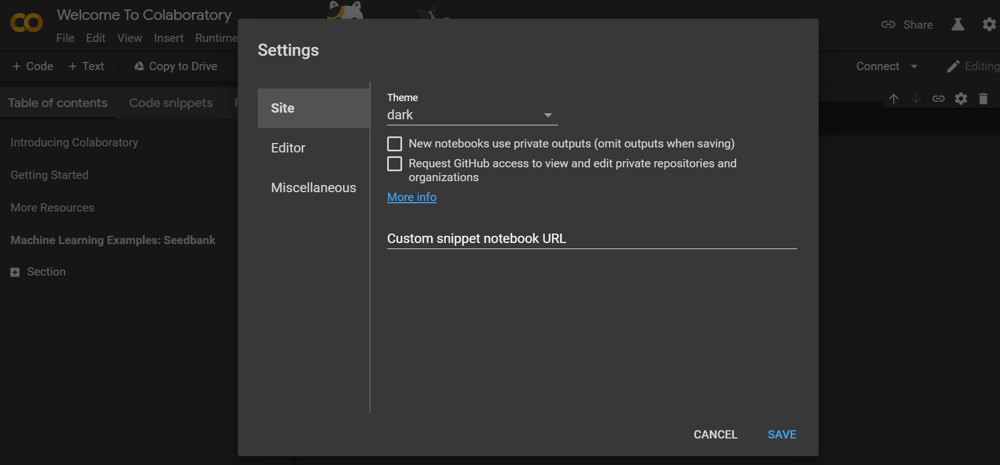
2.4 เราสามารถเลือกตกแต่ง Feature ได้ตามต้องการโดยกดไอคอนการตั้งค่าที่มุมบนขวา

3. การใช้งาน git

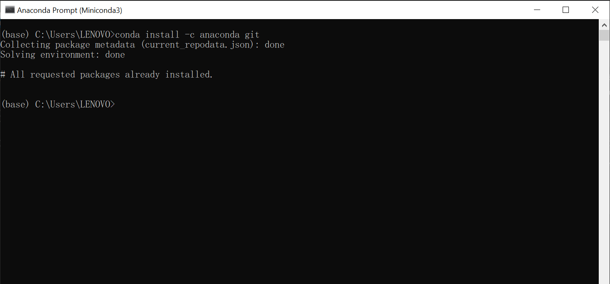
3.1 install ใน anaconda prompt โดยใช้คำสั่ง conda install -c anaconda git 

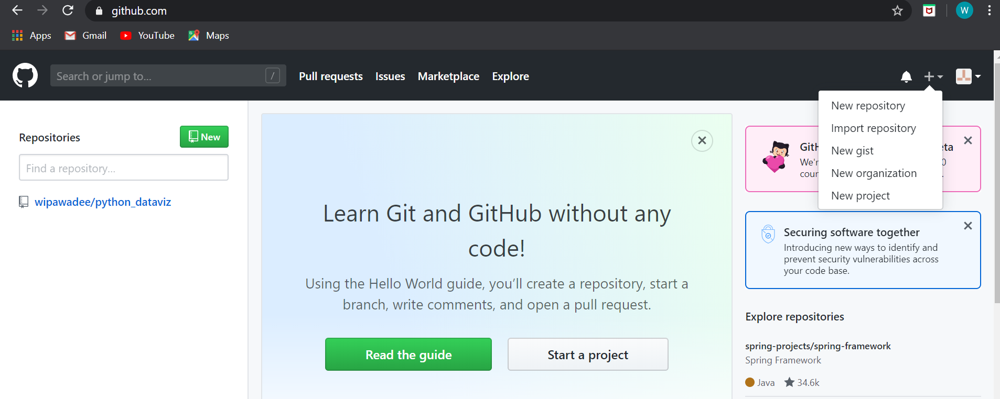
3.2 ค้นหา github.com บนอินเทอร์เน็ต สร้างบัญชีผู้ใช้และทำการเข้สู่ระบบให้เรียนร้อย จากนั้นสร้าง โดยเลือกไอคอนเครื่องหมายบวกมุมบนขวา และเลือกคำสั่ง New repository พร้อมตั้งชื่อตามต้องการ

3.3 พิมพ์ cd ใน anaconda prompt ตามด้วยชื่อไฟล์ที่สร้างใน git โดยพิมพ์แค่ตัวอักษรตัวแรก จากนั้นกดแป้นพิมพ์คำว่า Tab เพื่อป้องกันการพิมพ์ผิด

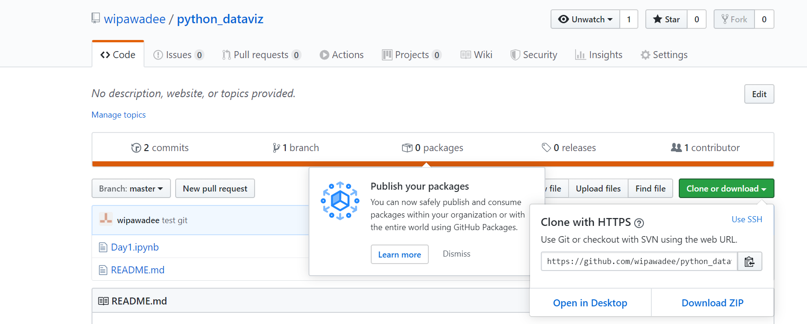
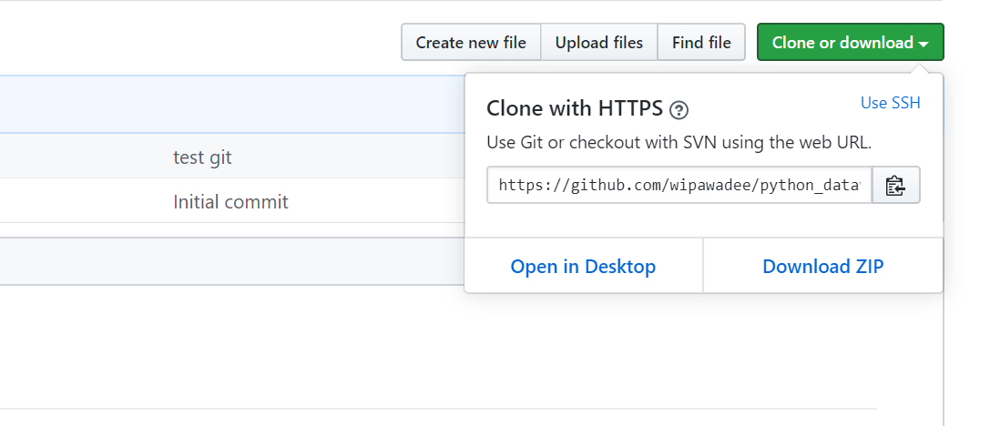
3.4 เชื่อมไฟล์ที่อยู่ใน anaconda prompt รวมกับ git โดยใช้คำสั่ง git clone ตามด้วยชื่อไฟล์เป็น URL ใน git ดูจาก clone or dowmload จากนนั้นทำการ copy URL

3.4 ใช้คำสั่ง git status เพื่อเช็ดชื่อไฟล์แล้วย้ายไฟล์เข้าไปอยู่ในโฟลเดอร์เดียวกันกับใน git โดยใช้คำสั่ง git add แล้วก็ลือกว่าเราจะย้ายไฟล์อะไรเข้าไปอยู่ใน Floder บ้าง เพื่อแอดไฟล์เข้าไปอยู่ในนั้น

3.5 ใช้คำสั่ง git commit -m "test git"เพื่อ เพื่อtest ดูว่าจะใช้ git ยังไง 

3.6 เมื่อมีerror ขึ้นหมายถึงยังไม่ได้บันทึก username password แก้ไขโดย copy error git config --global user.email "เปลี่ยนชื่อเป็น email ที่เราใช้งาน" และ git config -- global user.nama "ชื่อที่เราใช้งาน" จากนั้นใช้คำสั่ง git commit -m "test git" อีกครั้ง

3.6 ใช้คำสั่ง git push เป็นคำสั่งที่ทำให้ code ขึ้นไปอยู่บน internet กด Enter และใส่ username กด Enter จากนั้นใส่ Password โดย Password จะไม่แสดงเมื่อเราพิมพ์

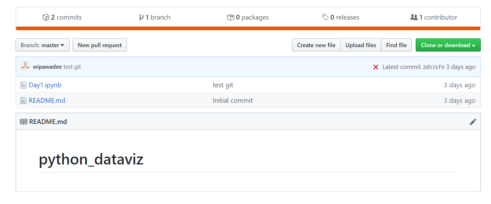
3.7 เข้าไปดูใน git อีกครั้งว่าไฟล์ที่เราลิ้งค์จาก jupyter เชื่อมกัน git แล้ว 

3.8 ไฟล์ที่เชื่อมกันสามาถแก้ไขผ่านโปรแกรม visual studio code ได้ โดยทำการโหลดลงคอมพิวเตอร์ก่อน
